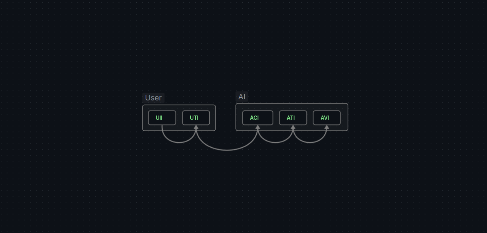

# Soul of Waifu - Core
[**| EN |**](README_EN.MD)

</img>

Art by: https://twitter.com/onisarashi

### |  Многомодульное ядро для общения с нейросетями

**Soul of Waifu** - консольный клиент для общения с нейросетями.

**Soul of Waifu Core** - ядро, реализующее взаимодействие с нейронными сетями, позволяющее добавлять их благодаря интерфейсным модулям. Расширяющие возможности ядра.


Ядро реализует ввод -> вывод текста и его преобразования по мере прохождения цепочки через интерфейсы реализованные модулями



Многомодульность ядра достигается за счёт системы аддонов. 
Каждый аддон реализует модуль под характеристики интерфейса.

Сменить модуль интерфейса в цепочке можно в `Настройки` (`Settings`)

### |  Начальная комплектация 

В этом репозитории, вы можете загрузить версию Soul of Waifu, которая имеет модули CharacterAI, ElevenLabs, Google Translate и PlaceHolder'ы, которые не дадут системе сломаться, если вы пожелаете отключить какой-то из модулей

[**CharacterAI**](https://beta.character.ai/) - Сервис для общения с нейросетями - персонажей в приватных комнатах!

[**Elevenlabs**](https://elevenlabs.io/) -   Сервис предоставляющий возможность озвучить текст! 

**Репозитории адднов**

Аддоны могут иметь свои репозитории и их можно загрузить в меню настройки аддонов Addon Settings --> Download Addon

Он склонирует репозиторий аддона в папку. 

Протестированные аддоны будут попадать в [Addon List](ADDON_LIST.MD)

### | Начать

Главное иметь полный набор компонентов Python:
- **Python 3.11** 
- Python-PIP
- Python-VENV
- [Git](https://git-scm.com/downloads)

> [!NOTE]
> Если вы пользователь Windows, то вы уже имеете полный пакет Python. И вам нужно будет установить [Git](https://git-scm.com/downloads) 
> Пользователям Linux стоит проверить свою систему на наличие этих компонентов

[Как скачать или установить тот или иной репозиторий](https://docs.github.com/en/repositories/working-with-files/using-files/downloading-source-code-archives)

Напомню, это не приложение, а лишь ядро с встроеным в него меню

Чтобы настроить модули ядра, которые вы собираетесь использовать пройдите в "Настройки" 
По умолчанию, они должны выглядеть так 

```
[1] | Метод Ввода : Keybord Input
[2] | Переводчик вашего текста : GoogleTranslater
[3] | Диалог с AI : CharacterAI Chat
[4] | Переводчик текста AI : GoogleTranslater
[5] | Метод озвучки : ElevenLabs Voice
[6] | Язык разговора : ru.yml
```
(Если нет, вы можете убить любого контербьютера на выбор)

Настройки отдельных модулей распалагаются в меню "Настройки Аддонов"

Мы обязаны так, делать, чтобы каждый модуль, можно было настроить отдельно и взаимодействовать с множеством API, настройки для которого предоставляют вам аддоны

Для стандартной конфигурации вам нужно проследовать в "Настройки Аддонов``**

1. [Настройка CharacterAI](addons/CharacterAI/README_RU.MD)
2. [Настройте ElevenLabs](addons/ElevenLabs/README_RU.MD)
3. Выход, Выход, Старт

## Для разработчиков аддонов

У ядра есть [документация](docs/ru/1.Components.MD) по вопросам [можно обратиться](https://gulysh.art)

Для публикации аддона, можете закоммитить  