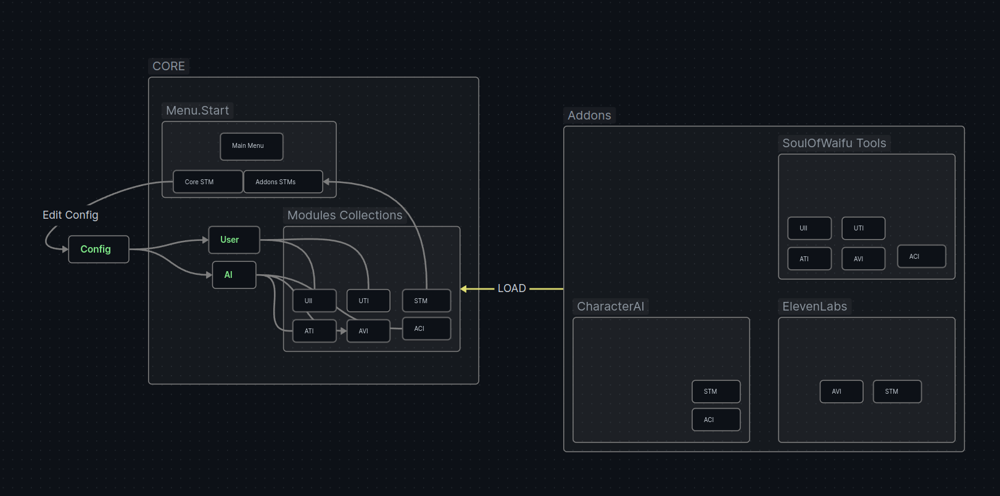
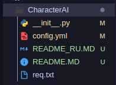

**Компоненты**
- [Идея](#идея)
  - [Ядро](#ядро)
  - [Интерфейсы](#интерфейсы)
    - [Виды интерфейсов](#виды-интерфейсов)
  - [Коллекции Модулей Интерфейсов](#коллекции-модулей-интерфейсов)
  - [Аддоны](#аддоны)
- [Меню](#меню)
  - [Как Создать меню](#как-создать-меню)
  - [Меню настроек](#меню-настроек)

# Идея

У каждого объекта, есть поля, есть методы 

Основной идеей, было реализовать систему в которой было бы не важна реализация методов объекта и дать возможность менять отдельные методы объекта в рантайме, дабы обеспечить вариативность использования одного и того же кода с разными реализациями отдельных элеметов рантайма. 

Таковыми элементами стали Пользователь и Нейросеть.

В которых было выделено пять общих интерфейсов, которые получают один тип данных и которые выдают одинаковый тип данных. 

**Пользовательские:**
- UII Интерфейс Ввода void (Ввод) -> str
- UTI Интерфейс Обработки перевода str -> str

**Искусственного интелекта**
- ACI Интерфейс Чата str -> str 
- ATI Интерфейс Обработки перевода str -> str
- AVI Интерфейс Озвучки str -> void (print, воспроизведение) 


Решением стало загрузка методов из собственной системы дополнений, которые в свою очередь были написаны на собственном "фреймворке"




Дополнения стали коллекциями в которых лежали модули реализующие интерфейсы (модули интерфейсов), а объекты "диалога", стали собираться в рантайм по значениям конфига и находящемеся с идентичными значениями ключей, модулями в подгруженной коллекции

Это кратко, о том, что происходит в ядре.

## Ядро

Ядро - это набор утилит и логики реализующей основной функцианал 

## Интерфейсы 

**Интерфейс** - компонент объекта, описывающий взаимодействие логики модуля с рантаймом.

**Модуль Интерфейса** - это встраиваемый на место интерфейса логический блок реализующий обработку входящих данных и возвращает подобный тип данных

```py
# Пример модуля интерфейса перевода. 
# Принимает текст типа строка, возращает текст типа строка

def translate_interface(text:str) -> str:
    return text
```


### Виды интерфейсов

**Пользовательские:**
- Интерфейс Ввода void (Ввод) -> str
- Интерфейс Обработки перевода str -> str

**Искусственного интелекта**
- Интерфейс Чата str -> str 
- Интерфейс Обработки перевода str -> str
- Интерфейс Озвучки str -> void (print, воспроизведение) 

**Меню**
- Интерфейс Менеджера Конфига модулей (config, addon) -> None


## Коллекции Модулей Интерфейсов 

Коллекции модулей интерфейсов, реализованы общим классом с полями содержащими словари, отсортированными по интерфейсам, модули которых они содержат

```py
uii user_input_interface() -> str
uti user_translate_interface(text:str) -> str
aci ai_chat_interface(text:str) -> str
ati ai_translate_interface(text:str) -> str
avi ai_voice_interface(text:str) -> None # Print() Play_voice()
stm settings_menus(config:Config, obj:Interface_Collection) -> None
```

## Аддоны

Аддон - это коллекция модулей интерфейсов, влючающая собственную реализацию модулей. Подгружаемая и рассортируемая по общей коллекции модулей

Аддон может производить инициализацию переменных модуля, а также позволять пересобирать модули при смене конфигурации

```py
# Как выглядит структура коллекции модулей интерефейса инпута (По аналогии и другие коллекции будут выглядеть также)

self.user_input_interface = {
    "Exemple Input" : exemple_user_input_interface_module_func
    "Exemple Microphone input" : exemple_user_input_interface_module_func
}
```

Инициализация аддона описывается общим классом, поля которого содержат списки своих реализаций интерфейсов

Инициализированный аддон передаётся функцией load_addon в файле **`__init__.py`**

```python
def load_addon():
    #      v Класс аддона            v Вызов конструктора 
	return Addon_Simple_Use_Template() # Ваш Аддон Класс

```

Вызов этой функции для каждого аддона происходит в загрузчике аддонов **`gulysh_lib.addon_lib.load_addons`** и гарантирует попадание в общую коллекцию и рассортировку


Аддон можно собрать из шаблона находящегося в `gulysh_lib.addon_lib.AddonTemplate` и добавив в `__init__.py` файл функцию возвращающию класс вашего аддона 


Структура аддона. Ваш репозиторий может выглядеть также.

**Пример:**

```py
from gulysh_lib.addon_lib import AddonTemplate

# Создаю класс аддона

class Addon_Simple_Use_Template(AddonTemplate):
    def __init__(self) -> None:
        # Инициализируем родительский класс фреймворка
        super().__init__()
        self.my_API_CLASS=VipAPI()

    def pre_init(self):
        pass

    # Переопределяю метод инициализации модулей интерфейсов

    def init_interfaces(self):
        # Определяю ссылку на объект модуля в пространсве имён инициализации 
        self = self

        # Добавляю модули интерфейсов

        # Декоратор добавление модуля интерфейса
        @self.add_Interface("Input Exemple", "user_input_interface")
        # Модуль интерфейса 
        def user_input_interface_exemple() -> str:
            return self.my_API_CLASS.send( input("Write to Neuro: ") )
        ...

# Функция инициализации аддона
        
def load_addon() -> AddonExemple:
    # Возвращаю уже собранный класс аддона 
    return Addon_Simple_Use_Template() # Ваш Аддон Класс
```


# Меню

> [!WARNING] *TO DO: Общий композитор, а не отрисовка окна модулем меню. Если вы переопределяли метод меню `Menu.start`.
Cтоит подумать, над бесшовностью обновления*

SOW Core - также обладает фреймворком, для того, чтобы можно было добавить свои меню


## Как Создать меню 

Чтобы создать собственное меню, стоит поместить его в класс аддона и наследоваться от основного класса меню в `gulysh_lib.menu_lib.Menu` 

```py

from gulysh_lib.addon_lib import AddonTemplate
from gulysh_lib.menu_lib import Menu

# Создаю класс Аддона. Как правильно это делать выше ^
class Addon_Class(AddonTemplate):
    ...

    class Addon_Menu(Menu):
        ...
```

И добавить его, как модуль `stm`, добавив с помощью декоратора функцию вызывающию меню.


> *Передаваемые значения могут измениться с рефакторингом*

```py
class Addon_Class(AddonTemplate):
    ...

    def init_interfaces(self):
        self=self 
        @self.add_Interface("Custom_Menu", "stm")
        def start_menu():
            self.Addon_Menu().start()

    class Addon_Menu(Menu):
        ...
```

Самое страшное что придумал автор этой дичи `selector` - Интерфейс взаимодействия с пунктами меню, принимающий коллекцию для выбора пользователем значения и возвращающий значение выбранное пользователем. 

Используется для вызова функций внутри коллекций, вызова других меню, применяется в классе `Settings_Menu`, для работы со значениями возвращаемыми в конфиг

По умолчанию меню вызывается функцией start, которая вызывает селектор и вызывает функции находящиеся в коллекции menu_fields (Поля меню) 

 > [!WARNING] 
 > Предупреждение, если вы решите переопределить этот метод, то можете попасть под условия рефакторинга описанными в TO DO*

```py
class Addon_Menu(Menu):
    ...
        
    def start(self):
            while True:
                
                self.clear_console()
                
                i = self.selector("Change menu point: ", self.menu_fields)
                
                if i == None:
                    return
                i()
```

Добавление полей в меню происходит переопределением функции `init_fields` 

```py
class Addon_Menu(Menu):
    def __init__(self, dbg=False) -> None:
        # Инициализирую родительский класс
        super().__init__(dbg)

    # Начинаю переопределять метод 
    def init_fields():
        ...
```


Чтобы добавить ваш пункт в меню, вам достаточно вызвать `self.add_field( "ЗАГОЛОВОК ЗНАЧЕНИЯ", ЗНАЧЕНИЕ)` передав заголовок в меню и значение возвращаемое при выборе селектором

`@self.add_fieldFunc("ЗАГОЛОВОК ЗНАЧЕНИЯ")` декоротатор, который позволяет вам добавлять в меню свои функции (Которые, также, могут вызывать другие меню)

```py

def init_fields():
    @self.add_fieldFunc("Заголовок")
    def Значение_Заголовка():
        #Вызов другого меню внутри функции под декоратором
        My_Settings_Menu(self.config, self).start()
```

## Меню настроек 

Для работы с конфигурационными файлами yaml, также был создан отдельный класс меню настроек  `gulysh_lib.menu_lib.Settings_Menu`.  Который принимает конфиг с которым работает и объект аддона для его перезагрузки 


На данный момент, есть возможность обрабатывать конфиг с двойной вложенностью и только с ней. Имейте ввиду, когда планируете свой конфиг.

> Если вам понадобиться обрабатывать любую другую вложенность, то придётся переопределить методы `get_conf_path`,  `add_settings_point`, `add_settings_write_point` 

*(Автор не знает, как можно попробовать обрабатывать динамическое колличество вложенностей, здесь прибито всё гвоздями;-;)*

**Как добавить меню настроек**

Это лишь модифицированный класс Menu. Создание и Добавление его будет похожим. 

Он наследуется от класса Menu. Его инициализация и работа с ним схожа с классом Menu. **Но он принимает ваш конфиг и объект аддона для перезагрузки**

```py
class Addon_Class(AddonTemplate):
    ...

    def init_interfaces(self):

        # Определяю объект модуля в блоке видимости метода 
        self=self 

        # Добавляю модуль интерфейса меню
        @self.add_Interface("Custom_Settings_Menu", "stm")
        # Модуль вызывающий меню 
        def start_menu():
            
            # Вызов Меню Настроек
            self.Addon_Menu(self.config, self).start()

    # Наш класс меню
    class Addon_Menu(Menu):
        def __init__(self, dbg) -> None:
        # Инициализирую родительский класс
        super().__init__(dbg)

    # Начинаю переопределять метод 
    def init_fields():
        ...
```


**Как работать с конфигами в меню**

Для добавления полей настроек, есть два метода `add_settings_point` для работы с коллекциями параметров (Выбор) и `add_settings_write_point` для ручного ввода пользователем значения поля (Ввод)

- `add_settings_point` принимает: Название поля, Объект обновляемый (чаще Аддон), Изменяемый параметр в конфиге, Коллекцию вариантов
- `add_settings_write_point` принимает: Название поля, Объект обновляемый, Записываемый параметр в конфиге

```yml
#Давай-те представим конфиг вида 
# yml
api:
    api_key: ""
    voice: "Voice 1"
```

```py
# python 
def init_fields():
        
        def init_fields(self):
            self = self
            # Пример коллекции с вариантами 

            collection = {
                "Voice 1" : "wqrtnmcvxp4q145sdfm",
                "Voice 2" : "asdfqrtasdasdmcvfhp4q497sdfm"
            }

            # Пример поля выбора из вышеобъявленной коллекции
            self.add_settings_point("Character", self.obj, "api.voice", collection)

            # Пример ввода API - ключа в виде поля ввода
            self.add_settings_write_point("API KEY", self.obj, "api.api_key" )
            
```
